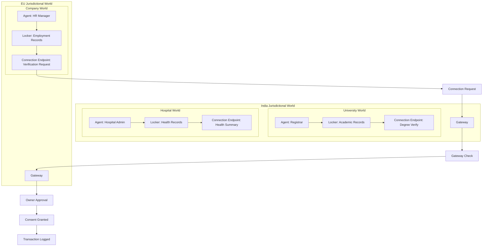
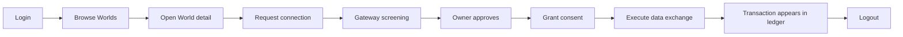
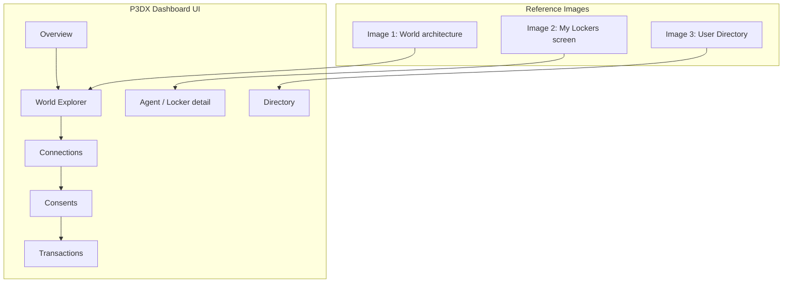

# P3DX — Cross-Border Data Exchange Dashboard

A React dashboard that makes the P3DX Worlds model visible, navigable, and operable:
nested trust domains (Jurisdiction → Institution → Department), each guarded by a single
Gateway, with connections, consents, and transactions flowing between agents who live
under different governance rules.

## Running it

```bash
npm install
npm run dev
```

Open the printed URL, usually `http://localhost:5173`. The app runs fully client-side and
persists state in `localStorage`.

## What the app models

- Worlds form a nested tree of jurisdictional, institutional, and departmental domains.
- Every World has exactly one Gateway on its boundary.
- Agents live inside Worlds and own Lockers.
- Lockers may publish Connection Endpoints.
- Connections must cross a Gateway, then be approved by the owner.
- Consents scope the exact data flow.
- Transactions record each governed exchange.

## Demo walkthrough

1. Log in with one of the two demo users.
2. Open the World Explorer to inspect nested Worlds and Gateways.
3. Use the Directory to enter an agent account and inspect lockers.
4. Request a connection to a published endpoint in another World.
5. Approve the connection, then grant consent.
6. Execute the exchange and review the transaction log.
7. Logout to clear the local session.

## Diagrams

### 1) Cross-border World architecture



### 2) User journey



### 3) UI and reference mapping



## Stack

React 19 + Vite, React Router, plain CSS (no UI library). State via `useReducer` and
Context, persisted to `localStorage`.
